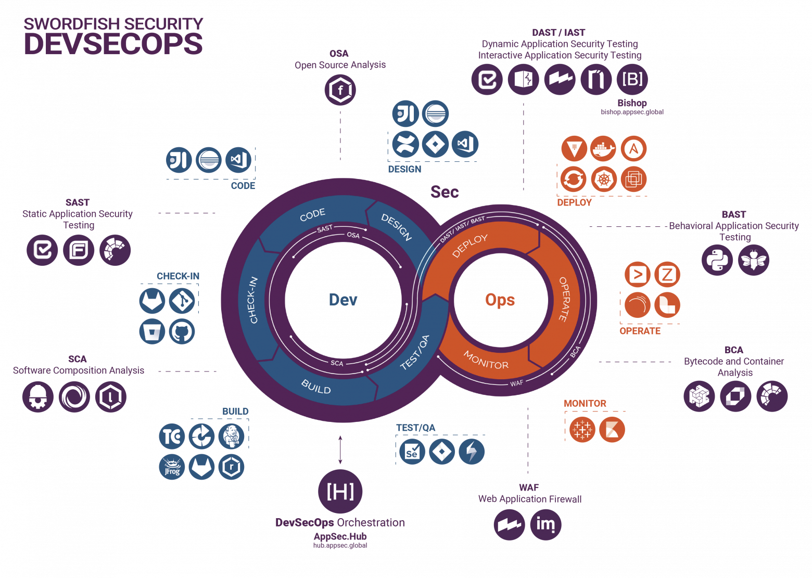

# Area-51

Виртуальная инфраструктура для DevSecOps, построенная на открытых решениях.

```
TODO:
- Демо
- Развёртывание
- База
- Конкретные пайплайны
```

## Стек


## Аппаратные требования

- CPU: `6 ядер`

- RAM: `12 Гб`

- Disk: `100 Гб`

## Запуск

> [!WARNING]  
> Должны быть установлены `Vagrant` и `VirtualBox`.

> [!TIP]
> Базовый box `ubuntu/focal64` можно скачать [отсюда](https://portal.cloud.hashicorp.com/vagrant/discover/ubuntu/focal64).

```shell
vagrant up
```

## DNS

Добавьте следующее в файл `hosts`:

```
192.168.33.11   ci.area51.local
192.168.33.12   defectdojo.area51.local
192.168.33.13   storage.area51.local
```

## Цикл DevSecOps



To be continued...
